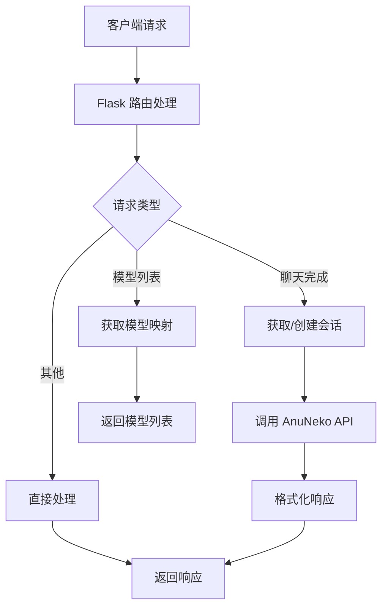

# AnuNeko OpenAI API 兼容接口详细文档

本文档详细介绍了 AnuNeko OpenAI API 兼容服务器的所有接口、参数、响应格式和使用方法。该服务器将 AnuNeko AI 模型包装为标准的 OpenAI API 格式，使您可以使用任何支持 OpenAI API 的工具和库与 AnuNeko AI 进行交互。

## 目录

1. [概述](#概述)
2. [认证方式](#认证方式)
3. [API 端点](#api-端点)
   - [聊天完成](#聊天完成)
   - [模型列表](#模型列表)
   - [会话管理](#会话管理)
   - [健康检查](#健康检查)
4. [请求与响应格式](#请求与响应格式)
5. [错误处理](#错误处理)
6. [高级用法](#高级用法)
7. [最佳实践](#最佳实践)
8. [快速入门指南](#快速入门指南)
9. [故障排除](#故障排除)

## 快速入门指南

### 1. 环境准备

首先确保您已安装必要的依赖：

```bash
pip install -r requirements.txt
```

### 2. 配置认证

创建 `.env` 文件并添加您的 AnuNeko Token：

```env
ANUNEKO_TOKEN=your_token_here
```

### 3. 启动服务器

```bash
python app.py
```

服务器将在 `http://localhost:8000` 启动。

### 4. 测试连接

使用以下 Python 代码测试 API 连接：

```python
from openai import OpenAI

# 创建客户端
client = OpenAI(
    api_key="dummy-key",  # 任意字符串，不会被实际使用
    base_url="http://localhost:8000/v1"
)

# 测试聊天完成
response = client.chat.completions.create(
    model="mihoyo-orange_cat",
    messages=[
        {"role": "user", "content": "你好，请介绍一下你自己"}
    ]
)

print(response.choices[0].message.content)
```

### 5. 流式响应示例

```python
stream = client.chat.completions.create(
    model="mihoyo-orange_cat",
    messages=[
        {"role": "user", "content": "请写一首关于春天的诗"}
    ],
    stream=True
)

for chunk in stream:
    if chunk.choices[0].delta.content is not None:
        print(chunk.choices[0].delta.content, end="", flush=True)
```

## 概述

AnuNeko OpenAI API 兼容服务器是一个基于 Flask 的 Web 服务，它实现了与 OpenAI API 兼容的接口，允许您使用标准的 OpenAI 客户端库与 AnuNeko AI 模型进行交互。

### 主要特性

- **完全兼容 OpenAI API**: 支持标准的 OpenAI API 格式和客户端库
- **多模型支持**: 支持橘猫(Orange Cat)和黑猫(Exotic Shorthair)等模型
- **流式响应**: 支持流式和非流式两种响应模式
- **会话管理**: 自动管理和维护与 AnuNeko 的会话
- **动态模型映射**: 自动获取并映射可用的 AnuNeko 模型
- **易于集成**: 只需更改 base_url 即可将现有 OpenAI 应用切换到 AnuNeko

## 技术架构

### 系统组件

AnuNeko OpenAI API 兼容服务器由以下主要组件组成：

1. **Flask Web 服务器**: 提供 HTTP API 接口
2. **AnuNeko API 客户端**: 与 AnuNeko 服务进行通信
3. **会话管理器**: 管理与 AnuNeko 的会话状态
4. **模型映射器**: 将 OpenAI 模型名称映射到 AnuNeko 模型

### 请求处理流程



### 会话管理机制

服务器使用内存字典存储会话信息：

```python
sessions: Dict[str, Dict[str, Any]] = {}
```

每个会话包含以下信息：
- `id`: 会话唯一标识符
- `anuneko_chat_id`: AnuNeko 聊天ID
- `model`: 当前使用的模型
- `openai_model`: OpenAI 兼容模型名称
- `created_at`: 创建时间
- `has_anuneko_chat`: 是否已创建 AnuNeko 会话

### 模型映射策略

1. **动态映射**: 服务器启动时自动获取 AnuNeko 可用模型
2. **命名规则**: `mihoyo-<模型名称小写并替换空格为下划线>`
3. **默认回退**: 无法获取模型列表时使用 Orange Cat 作为默认模型

## 认证方式

与 OpenAI API 不同，AnuNeko API 兼容服务器不使用 API Key 进行认证，而是通过环境变量配置 AnuNeko 的认证信息。

### 环境变量配置

```env
# 必需：AnuNeko API Token
ANUNEKO_TOKEN=your_token_here

# 可选：AnuNeko Cookie
ANUNEKO_COOKIE=your_cookie_here
```

### 客户端认证

在使用 OpenAI 客户端库时，您可以提供任意字符串作为 API Key，因为它不会被实际使用：

```python
from openai import OpenAI

client = OpenAI(
    api_key="dummy-key",  # 任意字符串，不会被实际使用
    base_url="http://localhost:8000/v1"
)
```

## API 端点

### 聊天完成

#### 端点
```
POST /v1/chat/completions
```

#### 描述
创建聊天完成请求，这是与 AnuNeko AI 模型交互的主要接口。

#### 请求参数

| 参数 | 类型 | 必需 | 描述 |
|------|------|------|------|
| model | string | 是 | 要使用的模型ID，如 `mihoyo-orange_cat` |
| messages | array | 是 | 消息对象数组，构成对话上下文 |
| stream | boolean | 否 | 是否启用流式响应，默认为 false |
| temperature | number | 否 | 控制输出的随机性，范围 0.0-2.0，默认 1.0 |
| max_tokens | integer | 否 | 生成的最大令牌数 |
| session_id | string | 否 | 指定要使用的会话ID，如果不提供则创建新会话 |

#### 消息对象格式

每个消息对象应包含以下字段：

| 字段 | 类型 | 必需 | 描述 |
|------|------|------|------|
| role | string | 是 | 消息角色，支持 "system"、"user"、"assistant" |
| content | string | 是 | 消息内容 |

#### 请求示例

```json
{
  "model": "mihoyo-orange_cat",
  "messages": [
    {"role": "system", "content": "You are a helpful assistant."},
    {"role": "user", "content": "你好，请介绍一下你自己"}
  ],
  "temperature": 0.7,
  "max_tokens": 1000,
  "stream": false
}
```

#### 响应格式（非流式）

```json
{
  "id": "chatcmpl-abc123",
  "object": "chat.completion",
  "created": 1677652288,
  "model": "mihoyo-orange_cat",
  "choices": [
    {
      "index": 0,
      "message": {
        "role": "assistant",
        "content": "你好！我是AnuNeko AI助手..."
      },
      "finish_reason": "stop"
    }
  ],
  "usage": {
    "prompt_tokens": 0,
    "completion_tokens": 0,
    "total_tokens": 0
  },
  "session_id": "uuid-string-here"
}
```

#### 响应格式（流式）

流式响应采用 Server-Sent Events (SSE) 格式：

```
data: {"id":"chatcmpl-abc123","object":"chat.completion.chunk","created":1677652288,"model":"mihoyo-orange_cat","choices":[{"index":0,"delta":{"content":"你好"},"finish_reason":null}]}

data: {"id":"chatcmpl-abc123","object":"chat.completion.chunk","created":1677652288,"model":"mihoyo-orange_cat","choices":[{"index":0,"delta":{"content":"！"},"finish_reason":null}]}

data: {"id":"chatcmpl-abc123","object":"chat.completion.chunk","created":1677652288,"model":"mihoyo-orange_cat","choices":[{"index":0,"delta":{},"finish_reason":"stop"}]}

data: [DONE]
```

### 模型列表

#### 端点
```
GET /v1/models
```

#### 描述
获取所有可用的模型列表。

#### 请求参数
无

#### 响应示例

```json
{
  "object": "list",
  "data": [
    {
      "id": "mihoyo-orange_cat",
      "object": "model",
      "created": 1677652288,
      "owned_by": "anuneko",
      "permission": [],
      "root": "mihoyo-orange_cat",
      "parent": null,
      "anuneko_model": "Orange Cat",
      "anuneko_model_id": 0
    },
    {
      "id": "mihoyo-exotic_shorthair",
      "object": "model",
      "created": 1677652288,
      "owned_by": "anuneko",
      "permission": [],
      "root": "mihoyo-exotic_shorthair",
      "parent": null,
      "anuneko_model": "Exotic Shorthair",
      "anuneko_model_id": 1
    }
  ],
  "anuneko_api_response": {
    "models": ["Orange Cat", "Exotic Shorthair"]
  }
}
```

### 会话管理

#### 获取会话列表

##### 端点
```
GET /sessions
```

##### 描述
获取所有活动会话的列表。

##### 请求参数
无

##### 响应示例

```json
{
  "sessions": [
    {
      "id": "uuid-string-here",
      "model": "mihoyo-orange_cat",
      "created_at": "2023-03-01T12:00:00.000000",
      "has_anuneko_chat": true
    }
  ],
  "total": 1
}
```

#### 删除会话

##### 端点
```
DELETE /sessions/<session_id>
```

##### 描述
删除指定的会话。

##### 路径参数

| 参数 | 类型 | 描述 |
|------|------|------|
| session_id | string | 要删除的会话ID |

##### 响应示例

成功删除：
```json
{
  "status": "success",
  "message": "会话已删除"
}
```

会话不存在：
```json
{
  "status": "error",
  "message": "会话不存在"
}
```

### 健康检查

#### 端点
```
GET /health
```

#### 描述
检查服务器的健康状态。

#### 请求参数
无

#### 响应示例

```json
{
  "status": "healthy",
  "timestamp": "2023-03-01T12:00:00.000000",
  "version": "1.0.0"
}
```

## 请求与响应格式

### HTTP 状态码

| 状态码 | 描述 |
|--------|------|
| 200 | 请求成功 |
| 400 | 请求参数错误 |
| 404 | 端点不存在 |
| 500 | 服务器内部错误 |

### 通用响应头

| 头部 | 值 | 描述 |
|------|----|------|
| Content-Type | application/json | 响应内容类型 |
| Access-Control-Allow-Origin | * | 允许跨域访问 |

### 流式响应头

| 头部 | 值 | 描述 |
|------|----|------|
| Content-Type | text/event-stream | SSE 流式响应 |
| Cache-Control | no-cache | 禁用缓存 |
| Connection | keep-alive | 保持连接 |

## 错误处理

### 错误响应格式

所有错误响应都遵循统一的格式：

```json
{
  "error": {
    "message": "错误描述",
    "type": "错误类型"
  }
}
```

### 常见错误类型

| 错误类型 | 描述 | 解决方案 |
|----------|------|----------|
| invalid_request_error | 请求参数无效 | 检查请求参数格式和内容 |
| server_error | 服务器内部错误 | 检查服务器日志，稍后重试 |
| authentication_error | 认证失败 | 检查 ANUNEKO_TOKEN 环境变量 |

### 错误示例

#### 请求体为空

```json
{
  "error": {
    "message": "请求体不能为空",
    "type": "invalid_request_error"
  }
}
```

#### 消息列表为空

```json
{
  "error": {
    "message": "messages 不能为空",
    "type": "invalid_request_error"
  }
}
```

#### 未找到用户消息

```json
{
  "error": {
    "message": "未找到用户消息",
    "type": "invalid_request_error"
  }
}
```

#### 服务器内部错误

```json
{
  "error": {
    "message": "服务器内部错误: 具体错误信息",
    "type": "server_error"
  }
}
```

## 高级用法

### 会话管理

服务器自动管理与 AnuNeko 的会话，每个 OpenAI 聊天完成请求都会映射到一个 AnuNeko 会话。

#### 会话生命周期

1. **创建会话**: 首次请求或未指定 session_id 时自动创建
2. **模型切换**: 如果请求的模型与当前会话模型不同，自动切换模型
3. **会话复用**: 指定 session_id 可以复用现有会话
4. **会话清理**: 可以通过 DELETE /sessions/<session_id> 手动删除会话

#### 会话持久化

会话信息存储在服务器内存中，服务器重启后会话会丢失。如需持久化会话，可以考虑：

1. 使用数据库存储会话信息
2. 实现会话序列化和反序列化
3. 添加会话过期机制

### 模型映射

服务器自动将 AnuNeko 模型映射为 OpenAI 兼容的模型名称：

| AnuNeko 模型 | OpenAI 兼容名称 |
|-------------|----------------|
| Orange Cat | mihoyo-orange_cat |
| Exotic Shorthair | mihoyo-exotic_shorthair |
| 其他模型 | mihoyo-<模型名称小写并替换空格为下划线> |

#### 动态模型映射

服务器启动时会自动从 AnuNeko API 获取可用模型列表，并动态生成映射关系。如果无法获取模型列表，将使用默认映射。

#### 自定义模型映射

可以通过修改 `app.py` 中的 `MODEL_MAPPING` 字典来自定义模型映射：

```python
MODEL_MAPPING = {
    "custom-model-name": "AnuNeko 模型名称"
}
```

### 流式响应处理

#### 客户端处理流式响应

使用 OpenAI 客户端库：

```python
from openai import OpenAI

client = OpenAI(
    api_key="dummy-key",
    base_url="http://localhost:8000/v1"
)

stream = client.chat.completions.create(
    model="mihoyo-orange_cat",
    messages=[
        {"role": "user", "content": "请写一首关于猫的诗"}
    ],
    stream=True
)

for chunk in stream:
    if chunk.choices[0].delta.content is not None:
        print(chunk.choices[0].delta.content, end="", flush=True)
```

使用标准 HTTP 客户端：

```python
import requests
import json

response = requests.post(
    "http://localhost:8000/v1/chat/completions",
    json={
        "model": "mihoyo-orange_cat",
        "messages": [{"role": "user", "content": "你好"}],
        "stream": True
    },
    stream=True
)

for line in response.iter_lines():
    if line:
        line = line.decode('utf-8')
        if line.startswith("data: "):
            data_str = line[6:]
            if data_str == "[DONE]":
                break
            try:
                data = json.loads(data_str)
                if "choices" in data and len(data["choices"]) > 0:
                    delta = data["choices"][0].get("delta", {})
                    if "content" in delta and delta["content"]:
                        content = delta["content"]
                        print(content, end="", flush=True)
            except json.JSONDecodeError:
                pass
```

## 最佳实践

### 1. 错误处理

始终实现适当的错误处理：

```python
try:
    response = client.chat.completions.create(
        model="mihoyo-orange_cat",
        messages=[{"role": "user", "content": "你好"}]
    )
    print(response.choices[0].message.content)
except Exception as e:
    print(f"请求失败: {e}")
```

### 2. 会话管理

对于长期对话，保存并复用 session_id：

```python
# 第一次请求
response = client.chat.completions.create(
    model="mihoyo-orange_cat",
    messages=[{"role": "user", "content": "你好"}]
)
session_id = response.session_id

# 后续请求使用相同会话
response = client.chat.completions.create(
    model="mihoyo-orange_cat",
    messages=[
        {"role": "user", "content": "继续我们之前的话题"}
    ],
    session_id=session_id
)
```

### 3. 模型选择

使用 `/v1/models` 端点获取可用模型列表：

```python
models = client.models.list()
for model in models.data:
    print(f"模型ID: {model.id}, AnuNeko模型: {model.anuneko_model}")
```

### 4. 流式响应

对于长文本生成，使用流式响应提供更好的用户体验：

```python
stream = client.chat.completions.create(
    model="mihoyo-orange_cat",
    messages=[{"role": "user", "content": "请写一个长故事"}],
    stream=True
)

for chunk in stream:
    if chunk.choices[0].delta.content is not None:
        print(chunk.choices[0].delta.content, end="", flush=True)
```

### 5. 性能优化

- 合理设置 `max_tokens` 参数，避免生成过长文本
- 使用适当的 `temperature` 值平衡创造性和一致性
- 对于批量请求，考虑使用异步客户端

## 故障排除

### 常见问题

#### 1. "Token 未提供" 错误

**症状**:
```
ValueError: Token 未提供，请设置 ANUNEKO_TOKEN 环境变量或直接传入 token 参数
```

**解决方案**:
- 确保 `ANUNEKO_TOKEN` 环境变量已正确设置
- 检查 `.env` 文件是否存在且格式正确
- 验证 Token 是否有效且未过期

#### 2. "无法创建会话" 错误

**症状**:
```
Exception: 无法创建会话
```

**解决方案**:
- 检查 Token 是否有效
- 确认网络连接正常
- 尝试重新获取 Token
- 检查 AnuNeko 服务是否可用

#### 3. "未找到模型映射" 警告

**症状**:
```
未找到模型映射，使用默认模型：Orange Cat
```

**解决方案**:
- 服务器将自动使用默认模型 (Orange Cat)
- 检查 AnuNeko API 是否可访问
- 确认请求的模型名称是否正确

#### 4. 流式响应中断

**症状**:
流式响应在中途停止或断开连接

**解决方案**:
- 检查网络连接稳定性
- 增加客户端超时时间
- 确认服务器端没有超时限制

#### 5. 响应格式错误

**症状**:
客户端无法解析响应 JSON

**解决方案**:
- 检查响应 Content-Type 是否为 application/json
- 确认响应内容不是 HTML 错误页面
- 检查服务器日志查看详细错误信息

### 调试技巧

#### 1. 启用调试模式

```bash
FLASK_DEBUG=True python app.py
```

#### 2. 检查服务器日志

服务器会输出详细的运行日志，包括：
- 模型映射更新
- 会话创建和切换
- API 请求和响应
- 错误信息

#### 3. 使用 curl 测试

```bash
# 测试健康检查
curl http://localhost:8000/health

# 测试模型列表
curl http://localhost:8000/v1/models

# 测试聊天完成
curl -X POST http://localhost:8000/v1/chat/completions \
  -H "Content-Type: application/json" \
  -d '{
    "model": "mihoyo-orange_cat",
    "messages": [{"role": "user", "content": "你好"}]
  }'
```

#### 4. 检查 AnuNeko API 连接

直接测试 AnuNeko API 可用性：

```python
import asyncio
from anuneko_api import AnuNekoAPI

async def test_anuneko():
    api = AnuNekoAPI()
    models = await api.model_view()
    print(f"可用模型: {models}")

asyncio.run(test_anuneko())
```

### 性能监控

#### 1. 响应时间监控

记录 API 请求的响应时间：

```python
import time

start_time = time.time()
response = client.chat.completions.create(...)
end_time = time.time()
print(f"请求耗时: {end_time - start_time:.2f}秒")
```

#### 2. 会话使用情况

监控会话数量和资源使用：

```bash
curl http://localhost:8000/sessions
```

#### 3. 错误率监控

记录和分析 API 错误：

```python
try:
    response = client.chat.completions.create(...)
except Exception as e:
    # 记录错误
    log_error(e)
```

## 部署和配置

### 生产环境部署

#### 使用 Gunicorn

```bash
# 安装 Gunicorn
pip install gunicorn

# 启动服务器
gunicorn -w 4 -b 0.0.0.0:8000 app:app
```

#### 使用 Docker

创建 `Dockerfile`:

```dockerfile
FROM python:3.9-slim

WORKDIR /app

COPY requirements.txt .
RUN pip install --no-cache-dir -r requirements.txt

COPY . .

EXPOSE 8000

CMD ["gunicorn", "-w", "4", "-b", "0.0.0.0:8000", "app:app"]
```

构建和运行：

```bash
# 构建镜像
docker build -t anuneko-openai .

# 运行容器
docker run -d -p 8000:8000 --env-file .env anuneko-openai
```

#### Docker Compose

创建 `docker-compose.yml`:

```yaml
version: '3.8'

services:
  anuneko-openai:
    build: .
    ports:
      - "8000:8000"
    env_file:
      - .env
    restart: unless-stopped
    healthcheck:
      test: ["CMD", "curl", "-f", "http://localhost:8000/health"]
      interval: 30s
      timeout: 10s
      retries: 3
```

启动服务：

```bash
docker-compose up -d
```

### 环境变量配置

除了基本的认证信息外，还可以配置以下环境变量：

```env
# AnuNeko 认证
ANUNEKO_TOKEN=your_token_here
ANUNEKO_COOKIE=your_cookie_here

# 服务器配置
FLASK_HOST=0.0.0.0
FLASK_PORT=8000
FLASK_DEBUG=False

# 性能配置
MAX_CONTENT_LENGTH=16777216  # 16MB
REQUEST_TIMEOUT=30
```

### 反向代理配置

#### Nginx 配置示例

```nginx
server {
    listen 80;
    server_name your-domain.com;

    location / {
        proxy_pass http://127.0.0.1:8000;
        proxy_set_header Host $host;
        proxy_set_header X-Real-IP $remote_addr;
        proxy_set_header X-Forwarded-For $proxy_add_x_forwarded_for;
        proxy_set_header X-Forwarded-Proto $scheme;
        
        # 流式响应支持
        proxy_buffering off;
        proxy_cache off;
    }
}
```

#### Apache 配置示例

```apache
<VirtualHost *:80>
    ServerName your-domain.com
    
    ProxyPreserveHost On
    ProxyRequests Off
    
    ProxyPass / http://127.0.0.1:8000/
    ProxyPassReverse / http://127.0.0.1:8000/
    
    # 禁用缓冲以支持流式响应
    ProxyPass /v1/chat/completions http://127.0.0.1:8000/v1/chat/completions flushpackets=on
</VirtualHost>
```

### 监控和日志

#### 日志配置

```python
import logging
from logging.handlers import RotatingFileHandler

# 配置日志
if not app.debug:
    file_handler = RotatingFileHandler('logs/anuneko-openai.log', maxBytes=10240, backupCount=10)
    file_handler.setFormatter(logging.Formatter(
        '%(asctime)s %(levelname)s: %(message)s [in %(pathname)s:%(lineno)d]'
    ))
    file_handler.setLevel(logging.INFO)
    app.logger.addHandler(file_handler)
    app.logger.setLevel(logging.INFO)
    app.logger.info('AnuNeko OpenAI API startup')
```

#### Prometheus 监控

添加 Prometheus 指标：

```python
from prometheus_client import Counter, Histogram, generate_latest, CONTENT_TYPE_LATEST

# 定义指标
REQUEST_COUNT = Counter('anuneko_requests_total', 'Total requests', ['method', 'endpoint'])
REQUEST_DURATION = Histogram('anuneko_request_duration_seconds', 'Request duration')

@app.before_request
def before_request():
    request.start_time = time.time()

@app.after_request
def after_request(response):
    duration = time.time() - request.start_time
    REQUEST_DURATION.observe(duration)
    REQUEST_COUNT.labels(method=request.method, endpoint=request.endpoint).inc()
    return response

@app.route('/metrics')
def metrics():
    return Response(generate_latest(), mimetype=CONTENT_TYPE_LATEST)
```

### 安全配置

#### HTTPS 配置

```python
from flask_sslify import SSLify

# 强制 HTTPS
if app.env == 'production':
    sslify = SSLify(app)
```

#### 速率限制

```python
from flask_limiter import Limiter
from flask_limiter.util import get_remote_address

limiter = Limiter(
    app,
    key_func=get_remote_address,
    default_limits=["200 per day", "50 per hour"]
)

@app.route('/v1/chat/completions', methods=['POST'])
@limiter.limit("10 per minute")
def chat_completions():
    # ...
```

### 性能优化

#### 缓存配置

```python
from flask_caching import Cache

cache = Cache(app, config={'CACHE_TYPE': 'simple'})

@app.route('/v1/models')
@cache.cached(timeout=300)  # 缓存5分钟
def list_models():
    # ...
```

#### 连接池配置

```python
# 在 anuneko_api.py 中配置连接池
class AnuNekoAPI:
    def __init__(self, token: str = None, cookie: str = None):
        # ...
        self.client = httpx.AsyncClient(
            limits=httpx.Limits(max_keepalive_connections=20, max_connections=100),
            timeout=30
        )
```

## 相关资源

- [AnuNeko 官网](https://anuneko.com/)
- [OpenAI API 文档](https://platform.openai.com/docs/api-reference)
- [Flask 文档](https://flask.palletsprojects.com/)
- [项目 GitHub 仓库](https://github.com/your-repo/anuneko-openai)